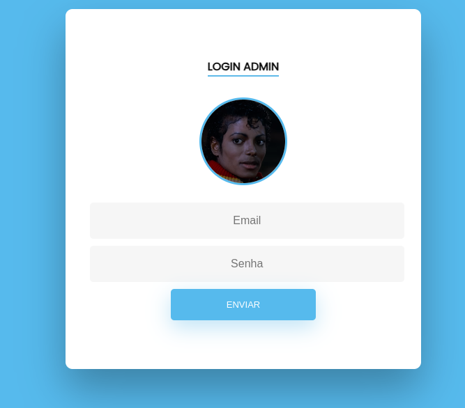
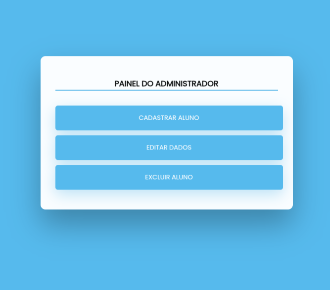

# 🏫 Sistema de Cadastro Escolar

Este projeto tem como objetivo desenvolver um sistema de **cadastro escolar** para **reservas de estudantes** em colégios da rede municipal.

## 👥 Usuários do sistema

- **Secretárias/diretoras** da escola — responsáveis pelo cadastro, edição e exclusão de alunos.
- **Visitantes** — qualquer pessoa poderá consultar os alunos cadastrados por escola e turma.

## 🔧 Funcionalidades

1. Cadastrar aluno  
2. Listar alunos cadastrados  
3. Editar dados dos alunos  
4. Excluir alunos  
5. Identificação de usuários (ADM - secretária/diretora)  
6. Página de login para administradores  

## 🗂 Estrutura do Projeto

### 🗃️ Banco de Dados
- Desenvolvido em **PostgreSQL**
- Estruturado com tabelas para:
  - Alunos
  - Escolas
  - Turmas
  - Turnos
  - Administradores
- O banco é responsável por armazenar todas as informações dos estudantes
⚠️ Observação: As tabelas **escola**, **turno**, **turma** e **administrador** devem ser preenchidas previamente via comandos SQL diretamente no banco de dados. O sistema não possui interface para cadastro dessas entidades.

### 🐍 Backend (Python)
- Framework: **Flask**
- Biblioteca para comunicação com o banco: **psycopg2**
- O Flask gerencia as rotas do sistema, como:
  - Rotas públicas de consulta
  - Rotas protegidas (login, cadastro, edição e exclusão)
- As consultas ao banco de dados são feitas manualmente com SQL via `psycopg2`, sem ORM, priorizando o controle direto sobre os comandos.

### 🎨 Frontend
- Inicialmente construído com **Bootstrap puro**, para prototipagem rápida.
- Após a conclusão da lógica de backend, o visual foi aprimorado com **HTML + CSS personalizado** para melhorar a estética e usabilidade.

---

## 🖼️ Imagens do Sistema

### 📌 Página Inicial

### 🔐 Login do Administrador

### ⚙️ Painel do Administrador

> As telas acima foram estilizadas com **CSS customizado**, o restante seguem apenas com Bootstrap.

---

## ✅ Status

🟢 Em desenvolvimento – funcionalidades principais implementadas, com melhorias visuais em andamento.	
